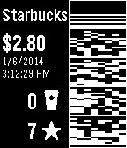

[Rebble App Store](https://apps.rebble.io/en_US/application/553aaf29bf1a5965020000c8)



Skunk
===============

Skunk is an app for the [Pebble Smartwatch](https://getpebble.com) that allows easy access to your store cards and other barcodes.

Based on [PebbleBucks 3.0 by a2](https://github.com/a2/PebbleBucks), [PebbleBucks 2.0 by Neal](https://github.com/Neal/PebbleBucks), and the [original PebbleBucks by Matt Donders](https://github.com/mattdonders/PebbleBucks).

Config is handled via a Ruby web app, [unlobito/skunk-config](https://github.com/unlobito/skunk-config)

Building and testing with Nix
-----------------------------

This project contains a [pebble.nix](https://github.com/Sorixelle/pebble.nix)
setup that can be used for building and testing. Builds are also automated
using GitHub Actions.

Assuming you have Nix installed, building is as simple as

```
$ nix-build
[...]
/nix/store/28ky82g54l35yysrwz79hly84pj4g6qj-skunk-arm-none-eabi
```

a `.pbw` and an appstore bundle are output to that directory, which is also
provided as a `./result` symlink.

For running the Pebble SDK directly for use with the Pebble emulator,
`nix-shell` can be used:

```
$ nix-shell

[nix-shell]$ pebble install --emulator basalt
Installing app...
App install succeeded.

[nix-shell]$ pebble emu-app-config
[Browser opens]
```
